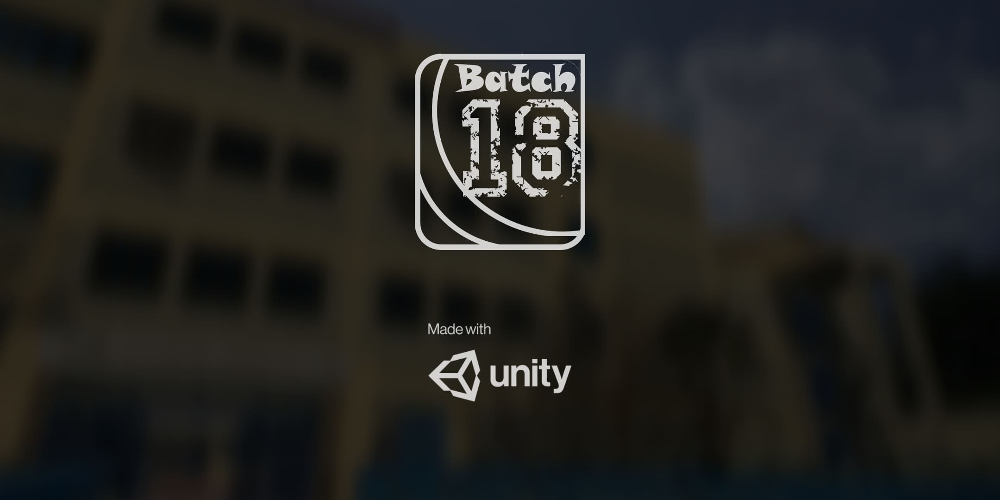
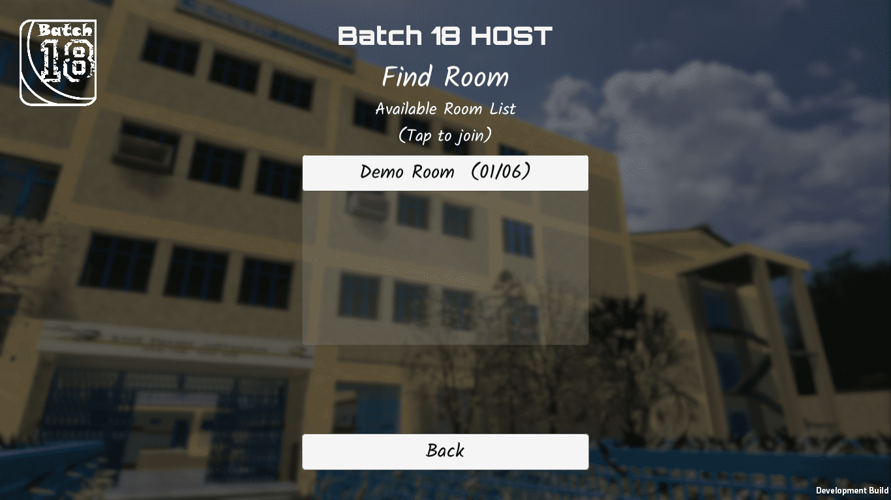

# Batch_18
**Batch_18** is based upon simple low poly 3D
fps game. The Batch_18 is multiplayer game in which main player (which is
also Host) creates a virtual room.

All online player and available virtual rooms will be displayed in the lobby.
Those who want to join a particular room will requests host and join room
as Client. The host will have full access to remove any player anytime from
the room. If Host deletes virtual room then all the clients are directed
towards the lobby where they can join another available room.

The main software used in development of the game is **Unity Game Engine**. As the game contains various low poly 3D models the software
used for 3D modeling is **Blender 2.8**, and Visual Studio as code editor. The
scripting of all the game assets is done in C# programming language.

  

## Screenshots

>**Splash Screen**

  

>**Add Player Info**

  

>**Find Room Screen**

  

>**Lobby Screen**

  

>**Game View**

  

>**Game View**

